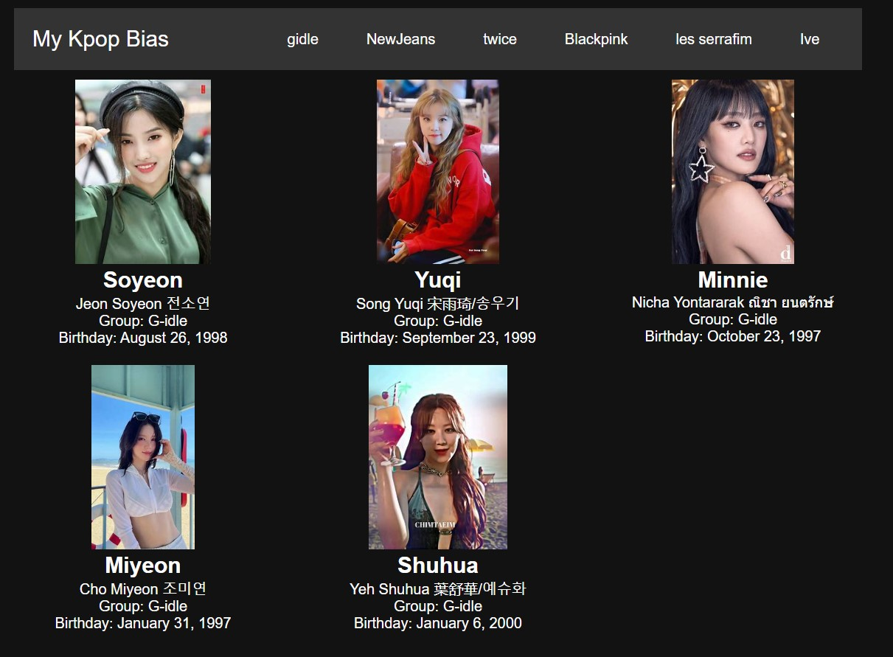
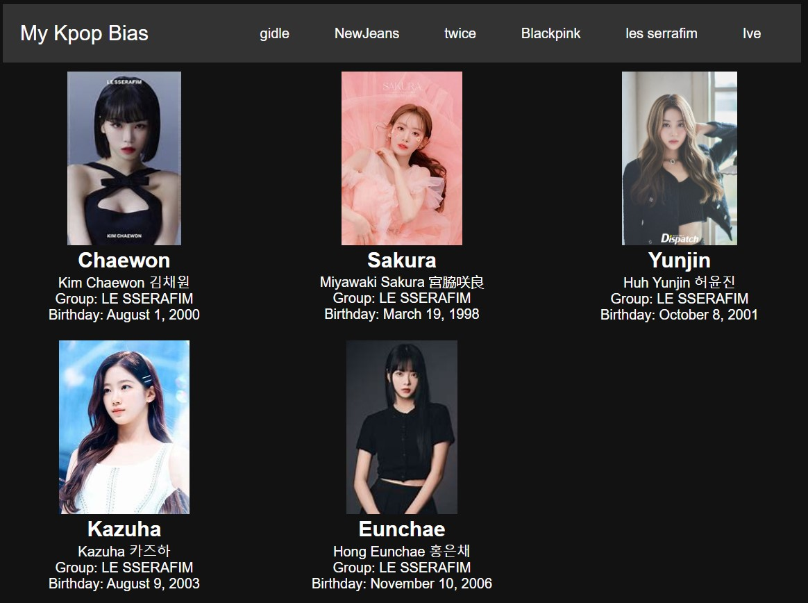
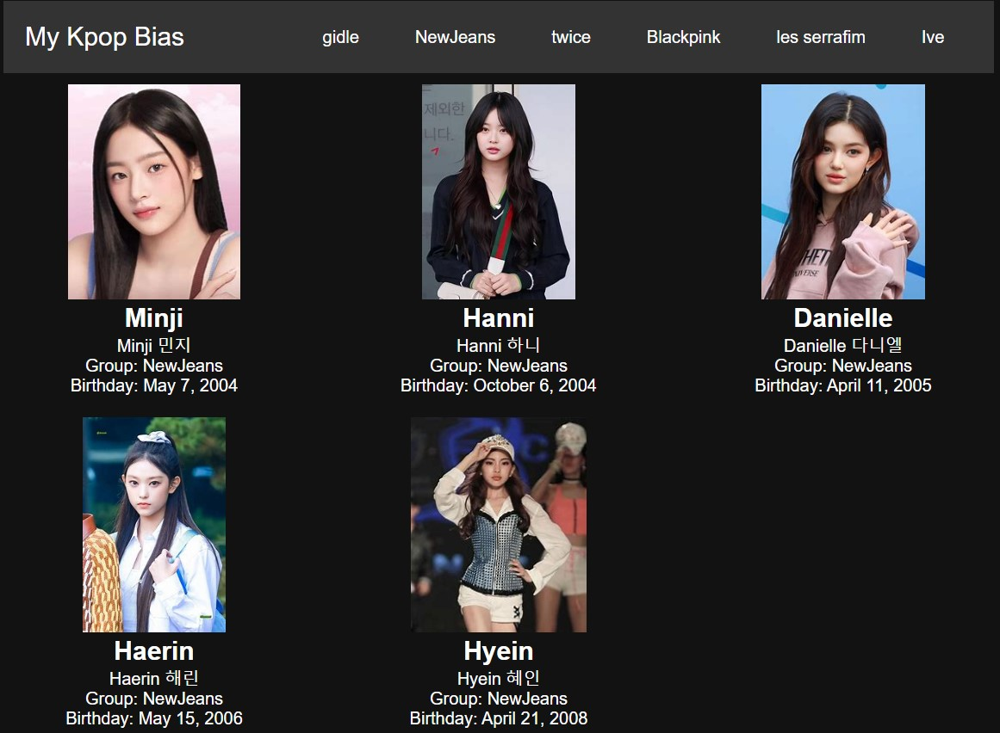
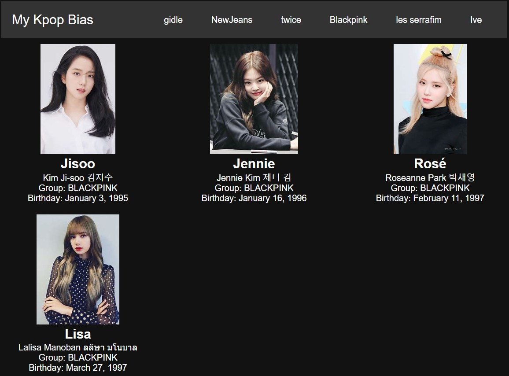
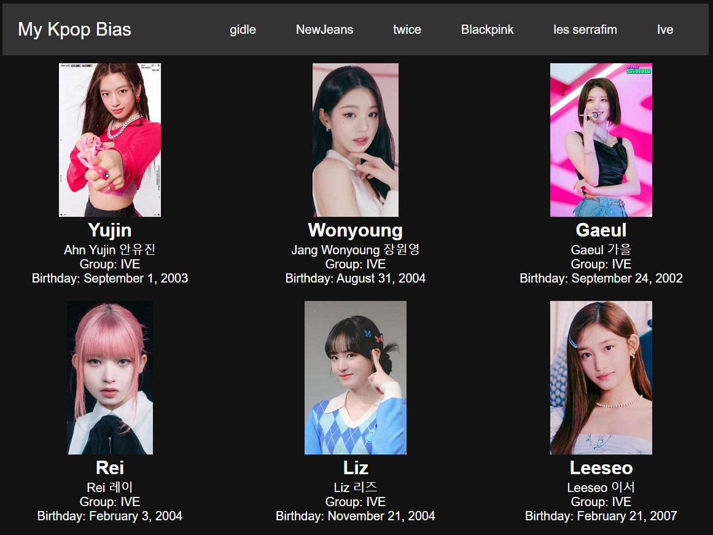
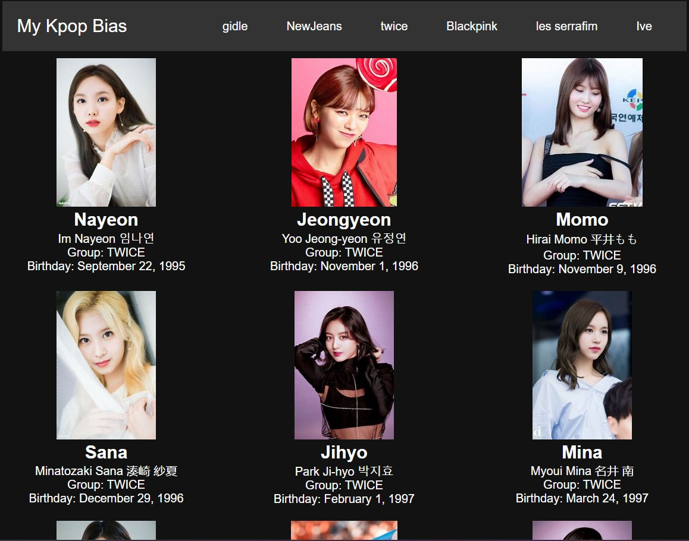

# WaiyatReactApp just front End

## Table of Contents
- [Start React](#start-react)
- [The Website](#the-website)
- [Content](#content)

## Start React
To start your React application in Visual Studio Code using the bash terminal:
1. First, run `npm install` after pulling the project.
2. Install React Router DOM: `npm install react-router-dom`
3. Install Axios: `npm install axios`

## The Website

## Content
I added The card of the website 
This girl group Kpop
GIDLE
NEWJEANS
IVE
TWICE
BLACKPINK
LESSERAFIM
